# Log Triage Agent 🔍

An AI-powered log triage system that watches for Java exceptions,
automatically gathers context, and delivers a root-cause analysis
to stakeholders — without human intervention.

Built with LangGraph, OpenAI, and Python.

---

## Why This Exists

In production, engineers waste hours manually triaging exceptions —
reading logs, finding the relevant code, querying the DB, piecing
together what went wrong. This agent does that in seconds.

---

## Architecture

**Why a fixed pipeline and not a dynamic agent?**
The debugging sequence for Java exceptions is deterministic —
you always need the code before the DB record, always need the
log before the code. A fixed pipeline is faster, cheaper, and
more predictable than letting the LLM decide tool order.

**Why no RAG?**
RAG solves "I don't know where to look." Stack traces tell us
exactly where to look — class name, file, line number. Deterministic
fetching is faster and more precise for this use case. RAG becomes
relevant at Goldman-scale codebases where the call chain spans
40+ functions across 15 files.

**Why gather-then-reason?**
Tools A, B, C are pure Python — no LLM involved. The LLM only
gets called once all context is cleanly assembled. This keeps
costs low and responses accurate.

**Local vs Remote mode**
Tool B supports both local file reading (for demo) and GitLab API
via a service account token (for production). Swap via env var.

---

## Running Locally

1. Clone the repo
2. Install dependencies
   pip install -r requirements.txt

3. Add your OpenAI key to .env
   OPENAI_API_KEY=your_key_here

4. Run
   python main.py

5. In a separate terminal, append an error to the log file
   echo 'ERROR 2024-01-15 14:23:11 [thread-12] req-abc123 - Transaction failed java.lang.NullPointerException at com.example.PaymentService.processPayment(PaymentService.java:47) at com.example.OrderController.checkout(OrderController.java:50) at com.example.UserRepository.findById(UserRepository.java:14)' >> sample_logs/errors.log
➜  incident-triage-agent git:(feature/v1) ✗ cat > sample_logs/errors.log << 'EOF'
